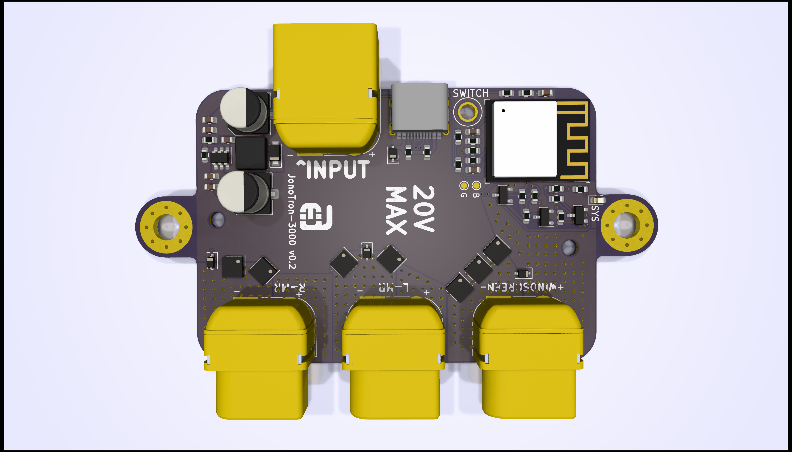
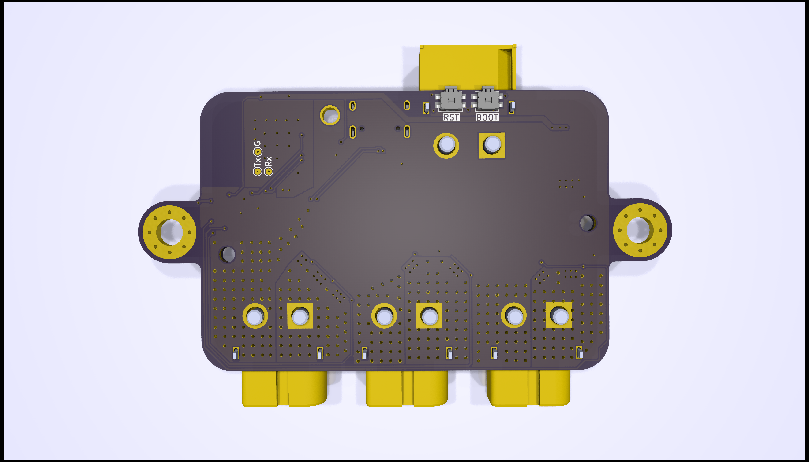
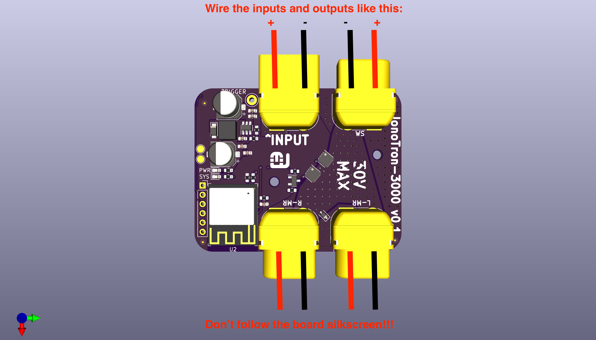
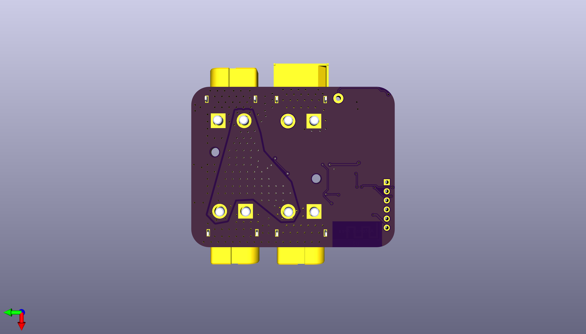
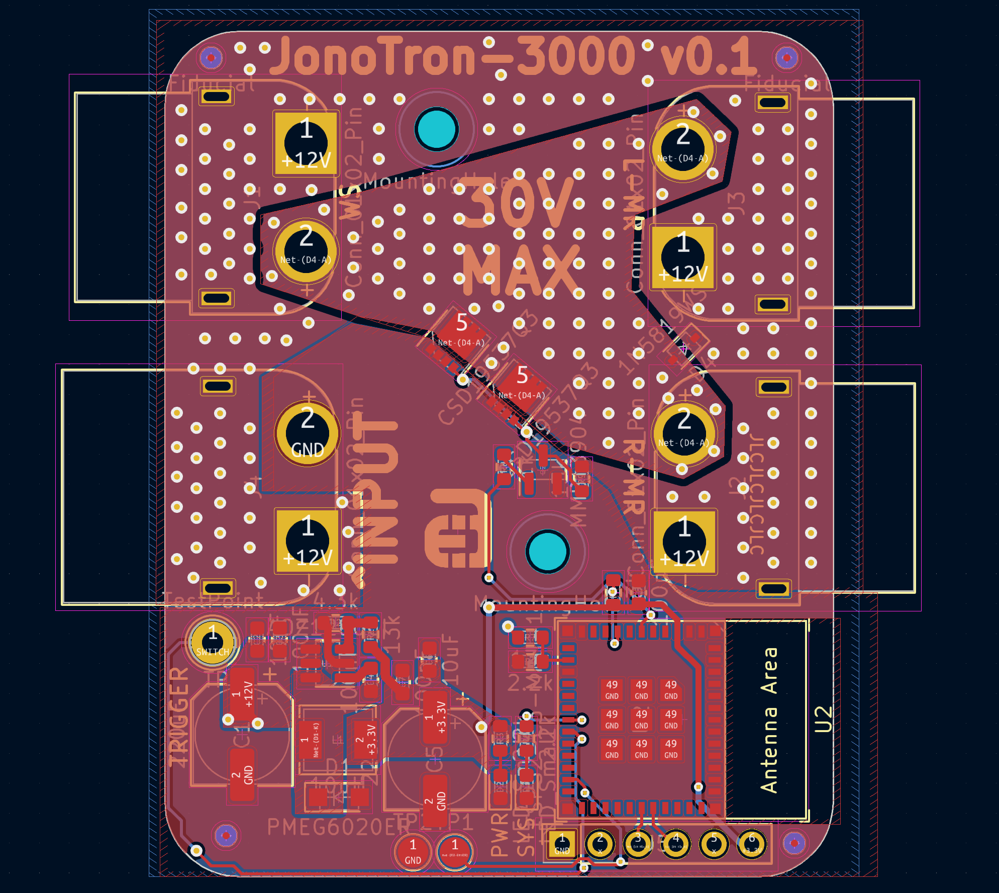
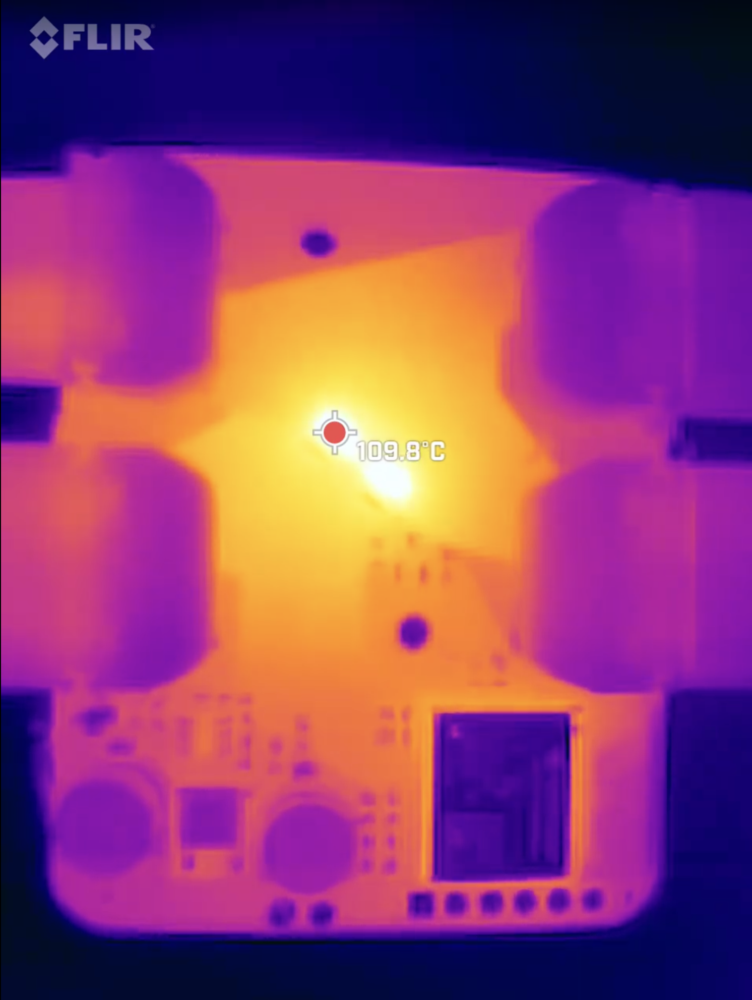
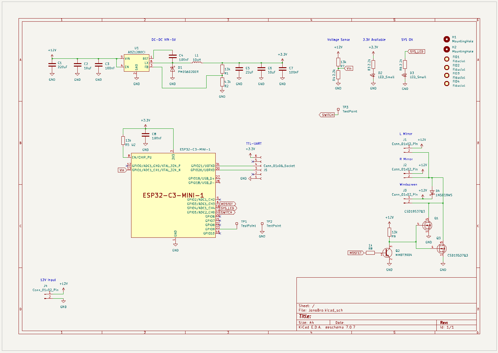

<h1 align="center">
    

  Ace's Electronics Pty Ltd  
  12V heater controller for mirrors and windscreens  
</h1>

# TOC:
1. <a href="#goals">Goals</a>
1. <a href="#current-states">Current States</a>
   - <a href="#reario-screen">RearIO: Screen</a>
1. <a href="#where-to-buy">Where to Buy</a>
1. <a href="#support">Support</a>
---
# Goals:
The overall goal of this project is to make a simple, robust and reliable heater controller for vehicles that have heated mirrors and windscreens, like a Land Rover Defender for example. The controller will be solid state and be able to handle up to 30A at 12-14V with a maximum input voltage of 20V.

Design goals:  
- Smallest form-factor possible while being able to handle 30A without getting too hot
- Simple configuration
- Easy to mount
- Zero maintenance

# JonoTron-3000 v0.2
Version two was made to addresss a couple of isssues, namely:
- Input and ouputs polarity was swapped, thanks to the xt-60 injection mould anomally that made a - look like a + when I eyeballed it to see which side was negative
- All outputs were tied together and were't individually controllable
- The board couldn't really handle 30A, not safely

I am waiting for the boards to turn up from JLCPCB.

v0.2 renders: 

## JonoTron-3000 v0.1
These first units have been used for circuit and load testing, and are not production ready. This is mainly due to the input and output polarities being accidently reversed. 

They do handle 30A, though they do get hot. The boards were only made from one ounce copper as I thought there was no way that the boards would end up working on first spin. the v0.1 boards were used to thoroughly test the concept, write the software and do destructive testing.

In the end the v0.1 units looked like this, Note: the polarity is reversed!!!: 

The circuit diagram, complete with the polarity swap mistake:

# Where to Buy:
TBA

## Support:
Contact me direct via ace<@>aceselectronics.com.au, just make it look like a normal email address. (hiding from the bots ;) )